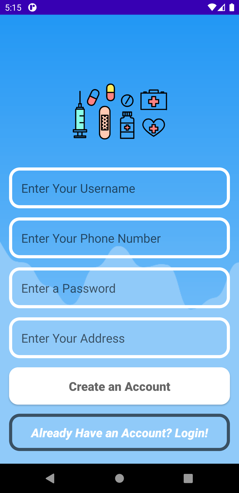
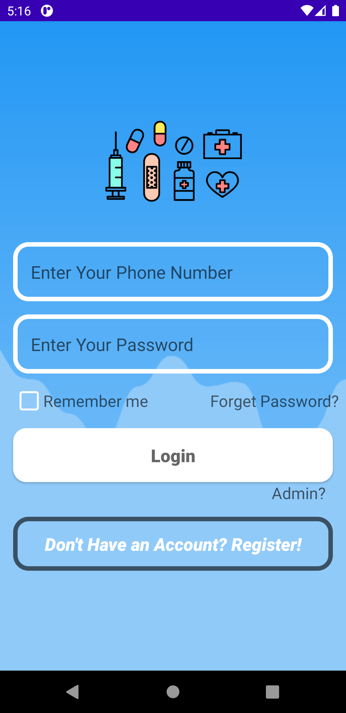
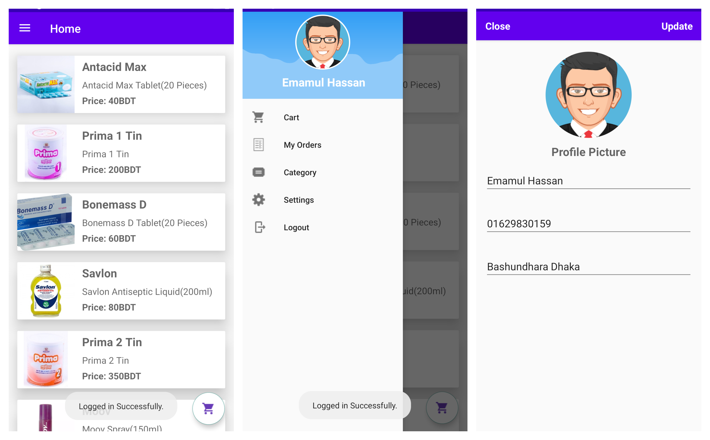
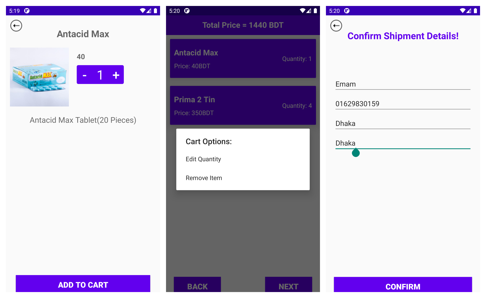
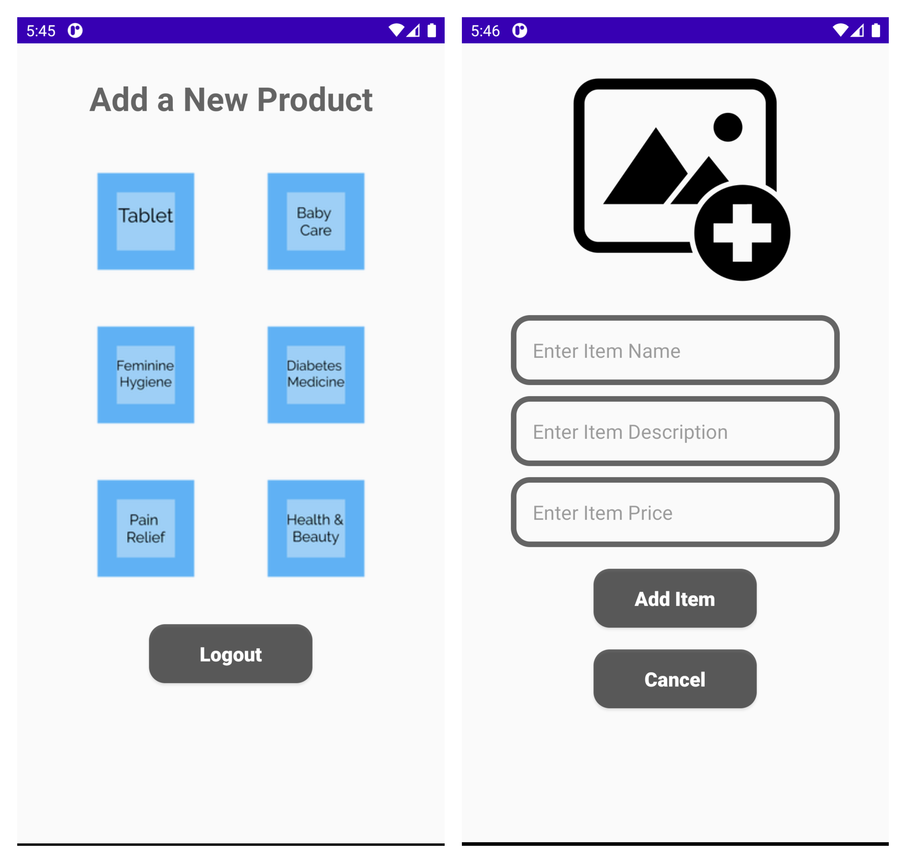
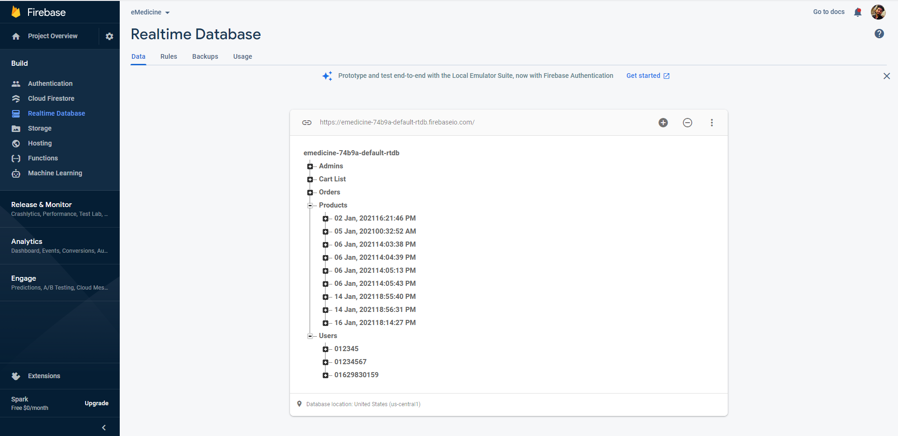

  

                                        

  <h1 align="center">Project Name: E-Medicine</h1>
  <h2 align ="center">Course Number: CSE 299 
  Section: 03 
  Semester: Fall 2020  
  Faculty Name: Shaikh Shawon Arefin Shimon</h2>
  <h3 align="center">Student Name: Emamul Hassan 
  Student ID: 1731250642 
  Email: emamul.hassan@northsouth.edu   
  Date prepared: 21/01/2021</h3>   

<h2> Project Name: E-Medicine </h2> 
<h3 id="table-of-contents">Table of Contents</h3>

<ol>
  <a href="#introduction"><li>Introduction</li> </a>
  <a href="#features"><li>Features</li> </a>
  <a href="#technology"><li>Technology</li> </a>
  <a href="#monetization"><li>Monetization</li></a> 
  <a href="#conclusion"><li>Conclusion</li></a> 

</ol>
 

<h2 id="introduction">1. Introduction</h2>

As covid-19 enters Bangladesh, it has affected many people. So, the government announced lockdown. Now, sick people are helpless. They can’t go out to see doctors or even buy their necessary medicine. There are many people live in city alone. So, it’s hard for them to buy medicine from a physical shop. Now here, the E-medicine app will make their life easy. In 2020, it’s rare to find someone without a smartphone. So, as people are already using smartphone on a daily basis why not make their life easier by letting them buy medicine online using an E-medicine application?
 
In this project, I will be developing an E-Medicine Application for Android. Any user can download this app for free and use it for their online medicine purchases. Not only medicines, the app will have a section where people can order for necessary item for babies like Diaper, Baby oil, Shampoo etc. This will help the single parents a lot by not going to a shop. The app will benefit a store to increase their number of sales, help the helpless and most importantly, develop an effective tool to help the healthcare system.

 

<h2 id="features">2. Features</h2>
This project has the following features -

<h3>2.1 User Registration:</h3>
  To access the application, a customer must have to register first. A customer can register with a phone number which will be used as their primary login service. This app will also ask for a Username which will be stored in the database. Customer must also input a Primary Address as it will be used to deliver the ordered item.
   

 

    
   Figure 1.0
 

 <h3>2.2 User Login:</h3>
  Customers who have registered, can use their phone number and password to login to access the app and order item for the app. 
   
  

   
  Figure 2.0
 

  

<h3>2.3 Primary Features:</h3>
  
Currently the following functions are available for Customers-
  

    * Remember me Feature is available for user to remember their login. 
    * After a successful login customer will land on the HomePage of the App. 
    * A Menu Drawer is available for customer to browse different options. 
    * Customer can search their desired medicine or other item from available in the app. 
    * Settings menu to update User name, Phone number and Address. 
    * Check details of each item available. 
    * Add to cart option for each item. 
    * Cart menu to see ordered items and total price. 
    * Edit quantity or remove item feature available in cart menu. 
    * Final customer details input section for delivery location. 
    * Cart menu will be cleared after an order. 
    

	  	 
	  	Figure 4.0
	
 

	  	 
	  	Figure 5.0
	
 

 
<h3>2.4 Admin Feature:</h3>
  
Currently the following functions are available for Admins-
  

    * After a successful login admin will land on the a unique HomePage for admins. 
    * There are 6 item categories available for admin to add item to them. 
  

       
      Figure 6.0
  
 

   
<h3>2.5 Admin Panel:</h3>
There's also a Admin panel in Firebase Database, from which the Admin can delete spam accounts, control and manage both users and items. They can also assign new admins or sub admins with filtered permission and monitor activities.

 
Figure 7.0

  

 <h2 id="technology">3. Technology</h2>
 <h3>Android Studio: </h3>
 
For Developing this E-Medicine app, I have chosen Android Studio developed by Google. Android Studio is the official integrated development environment for Google's Android operating system, built on JetBrains' IntelliJ IDEA software and designed specifically for Android development. It provides a unified environment where you can build apps for Android phones, tablets, Android Wear, Android TV, and Android Auto. Structured code modules allow you to divide your project into units of functionality that you can independently build, test, and debug.

 <ul>
    <li> Robust and flexible build system: Android Studio offers build automation, dependency management, and customizable build configurations. You can configure your project to include local and hosted libraries, and define build variants that include different code and resources, and apply different code shrinking and app signing configurations.</li>
    <li>Designed for teams: Android Studio integrates with version control tools, such as GitHub and Subversion, so you can keep your team in sync with project and build changes. The open source Gradle build system allows you to tailor the build to your environment and run on a continuous integration server such as Jenkins.</li>
    <li>Optimized for all Android devices : Android Studio provides a unified environment where you can build apps for Android phones, tablets, Android Wear, Android TV, and Android Auto. Structured code modules allow you to divide your project into units of functionality that you can independently build, test, and debug.</li>
</ul>

 <h3>Firebase Database: </h3>
 
For Data management I have chosen Google's Firebase Database.The Firebase Realtime Database is a cloud-hosted NoSQL database that lets you store and sync data between your users in realtime. SQLite is local database on Android device (data stored/processed on a device) with SQL interface, which makes FireBase suitable for real time applications. Cloud Firestore enables you to store, sync and query app data at global scale. The reason for using firebase is that its free, user friendly and has multiple features, such as:

<ul>
    <li> Realtime: Instead of typical HTTP requests, the Firebase Realtime Database uses data synchronization—every time data changes, any connected device receives that update within milliseconds. Provide collaborative and immersive experiences without thinking about networking code.</li>
    <li>Offline: Firebase apps remain responsive even when offline because the Firebase Realtime Database SDK persists your data to disk. Once connectivity is reestablished, the client device receives any changes it missed, synchronizing it with the current server state.</li>
    <li>Accessible from Client Devices	: The Firebase Realtime Database can be accessed directly from a mobile device or web browser; there’s no need for an application server. Security and data validation are available through the Firebase Realtime Database Security Rules, expression-based rules that are executed when data is read or written.</li>
    <li>Scale across multiple databases	: With Firebase Realtime Database on the Blaze pricing plan, you can support your app's data needs at scale by splitting your data across multiple database instances in the same Firebase project. Streamline authentication with Firebase Authentication on your project and authenticate users across your database instances. Control access to the data in each database with custom Firebase Realtime Database Rules for each database instance.</li>
</ul> 

All informations are taken from–

  <a href="https://developer.android.com/studio/features">Android Studio</a>
  and 
	<a href="https://firebase.google.com/docs/database">Firebase Database</a>

  
  

<h2 id="monetization">4. Monetization</h2>

As an online application, I will add Google AdSense to monetize the application to help me with the fund for its future development. 
  

<h2 id="conclusion">5. Conclusion</h2>

In summary the app is an online medicine delivery app which was developed to use any people. In this project we completed most of the functionalities proposed. Except the API part of payment system. Though basic features of the app works fine, there are no auto location features. Also one more major problem is, I could not implement the business or monetization plan using Google-AdSense. A order is only controlled by the Admin of Firebase. Admin cannot use this app to complete orders. He must go to firebase database to finish the order. Without this feature the app is incomplete. Search option is not complete. Also i could not implement review and rating system due to shortage of time. In future, I plan to implement these missing functionalities,come up with better solution for the implementation and make the app even better.

